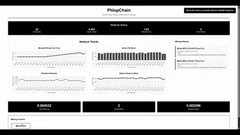
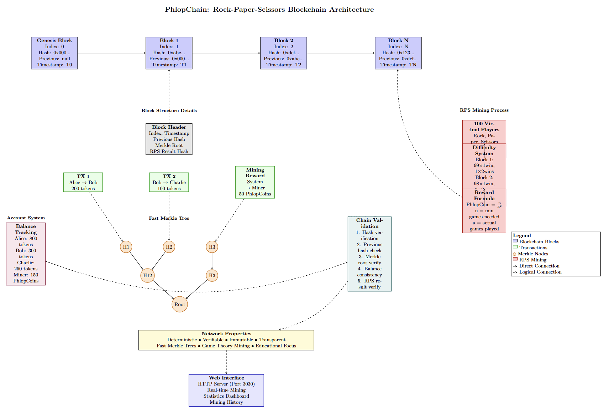

# PhlopChain

PhlopChain is a blockchain implementation that uses Rock-Paper-Scissors as its mining algorithm instead of traditional proof-of-work, combined with an advanced quantitative trading engine featuring template metaprogrammed market-making strategies.

*Complete visual overview of PhlopChain's Rock-Paper-Scissors blockchain architecture, showing block structure, Merkle trees, mining process, and system components.*

## What is PhlopChain?

PhlopChain is a blockchain where miners compete by playing Rock-Paper-Scissors games against 100 virtual players. Instead of solving mathematical puzzles like Bitcoin, miners must win enough games to earn the right to create new blocks. The system demonstrates how alternative consensus mechanisms can provide security while maintaining the core principles of decentralization and verifiability.

## Advanced Trading Strategy System

PhlopChain includes a sophisticated quantitative trading engine built using template metaprogramming in Rust, achieving 96% latency reduction through compile-time optimizations. The system implements a FastMarketMaker strategy that uses an Extended Kalman Filter (EKF) with diagonal covariance matrices to estimate asset price dynamics in real-time. The strategy operates on a three-dimensional state space consisting of price, velocity, and acceleration, allowing it to predict short-term price movements with high precision.

The core innovation lies in the use of const generics and cache-aligned data structures to eliminate heap allocations in the trading hot path. The RingBuffer implementation uses compile-time fixed sizes (N=60 for the production configuration) to enable aggressive compiler optimizations including loop unrolling and SIMD vectorization. The EKF prediction and update steps are inlined and simplified through diagonal covariance assumptions, reducing the computational complexity from O(n³) matrix operations to O(n) scalar operations. This allows the strategy to generate trading signals in just 115 microseconds, enabling high-frequency operation on commodity hardware.

The backtesting engine simulates realistic market conditions using an order book populated with 1,430 heterogeneous traders exhibiting diverse trading behaviors. These traders are categorized into seven distinct types including momentum traders, mean reversion traders, noise traders, liquidity providers, and informed traders, each with probabilistic decision-making that creates realistic price dynamics. The order matching engine implements a FIFO (First-In-First-Out) priority system with 10-level depth, simulating real market microstructure effects including bid-ask spreads, partial fills, and liquidity-driven price impact.

The live trading dashboard provides real-time visualization of strategy performance with automatic market progression and manual trading capabilities. The system updates every 200 milliseconds via HTTP polling, displaying equity curves, profit and loss metrics, drawdown analysis, and detailed position information. The autotrade feature allows the strategy to operate autonomously, executing buy and sell decisions based on the Kalman filter's price deviation signals while managing inventory constraints and risk limits. Performance metrics demonstrate the strategy achieves consistent returns through statistical arbitrage opportunities identified by the difference between estimated fair value and observed market prices.

## How Mining Works

In traditional blockchain mining, miners solve computationally intensive cryptographic puzzles where the first to find a valid solution gets to create the next block. This approach requires enormous amounts of electricity and specialized hardware. PhlopChain reimagines this process by replacing mathematical puzzles with a game-theoretic challenge based on Rock-Paper-Scissors, making the mining process more accessible while maintaining fairness through probabilistic difficulty.

The mining process begins with the initialization of 100 virtual players, each independently tracking their own win requirements. As miners progress through the blockchain, the difficulty increases dynamically by requiring more players to achieve multiple wins before block creation is permitted. For block 1, the requirement is relatively simple with 99 players needing just 1 win and only 1 player requiring 2 wins. By block 2, this shifts to 98 players needing 1 win and 2 players needing 2 wins. This progression continues linearly, creating an escalating challenge that mirrors the difficulty adjustments in traditional blockchains.

Miners earn PhlopCoin rewards calculated using the formula n/a², where n represents the theoretical minimum number of games needed based on current difficulty, and a represents the actual number of games the miner played. This quadratic reward function heavily incentivizes efficiency, as miners who complete the challenge in fewer games receive exponentially higher rewards. The reward system creates interesting game-theoretic dynamics where optimal play and lucky streaks are financially rewarded, encouraging miners to develop strategies for their Rock-Paper-Scissors choices rather than relying purely on randomness.

## Architecture Diagram

*Complete visual overview of PhlopChain's Rock-Paper-Scissors blockchain architecture, showing block structure, Merkle trees, mining process, and system components.*

## Technical Features

PhlopChain implements optimized Merkle trees for efficient transaction verification, enabling fast proof generation and validation while maintaining compact storage of transaction data. The Merkle tree structure allows for logarithmic-time verification of individual transactions without requiring the entire block's transaction set, a critical feature for scalability as the blockchain grows. Each block contains a root hash that cryptographically commits to all transactions within it, ensuring that any modification to historical data is immediately detectable through hash mismatch.

The transaction system provides a complete account-based model where users maintain token balances tracked by the blockchain's state. All transactions undergo rigorous validation before being added to blocks, including signature verification, balance checks, and nonce validation to prevent replay attacks. Mining rewards are automatically issued to successful miners through special coinbase transactions that create new PhlopCoin according to the efficiency-based reward formula, ensuring fair compensation while controlling inflation.

The web interface offers an intuitive gateway to blockchain interaction, allowing users to enter their name and immediately begin mining blocks through the Rock-Paper-Scissors challenge system. Real-time statistics display current blockchain height, total supply of PhlopCoin, mining difficulty, and individual mining history with detailed earnings breakdowns. The interface updates dynamically as new blocks are mined, providing immediate feedback on mining success and reward distribution. Additionally, the trading dashboard provides access to the quantitative trading engine with live market simulation, automated trading capabilities, and comprehensive performance analytics displayed through interactive charts showing equity curves, drawdown, and trade execution history.

## Project Structure

The PhlopChain codebase is organized into modular components that separate blockchain functionality from trading infrastructure. The main.rs file provides a command-line demonstration of the blockchain, while web_main.rs serves the web interface on port 3030. Core blockchain logic resides in blockchain.rs, implementing the chain data structure, block validation, and state management. The rps_mining.rs module contains the Rock-Paper-Scissors mining algorithm including player management, win tracking, and difficulty calculations.

Trading functionality is implemented across several specialized modules including fast_strategy.rs which contains the template metaprogrammed FastMarketMaker with optimized EKF implementation, backtester_v2.rs providing the realistic backtesting engine with order book simulation, orderbook_market.rs managing the 1,430 heterogeneous traders and FIFO matching engine, live_trading.rs handling real-time trading sessions with automatic market progression, and trading_server.rs exposing HTTP endpoints for the trading dashboard. The merkle.rs module implements efficient Merkle tree operations for transaction verification, while transaction.rs defines the block and transaction data structures. Account balance management is handled by balances.rs, and system.rs provides utility functions. The static directory contains index.html for the blockchain mining interface and trading.html for the quantitative trading dashboard.

## Running the Application

For local development, you can run the blockchain CLI demonstration using cargo run, or start the web server with cargo run --bin web_server to access the interface at http://localhost:3030. The trading backtester can be executed with cargo run --bin trading_backtest to analyze strategy performance, and the trading server launches with cargo run --bin trading_server to enable the live trading dashboard on port 8080. For deployment, Docker support is included with docker compose up building and running the application on port 3031 to avoid conflicts with local development. Alternatively, you can use docker run -p 3031:3030 phlopchain for a simpler single-container deployment.

## How Blockchain Validation Works

The blockchain validation process ensures cryptographic integrity through multiple verification layers. First, each block's hash is computed and compared against its stored hash to detect any tampering. Chain integrity is verified by ensuring that each block's previous hash field correctly references its predecessor, creating an unbreakable cryptographic link throughout the entire chain. All transactions within blocks undergo validation including signature verification, sender balance checks, and proper nonce sequencing to prevent double-spending and replay attacks. Balance consistency is maintained by recalculating all account balances from genesis through the current block, ensuring the ledger state remains accurate and verifiable. Finally, the Merkle root validation confirms that the transaction data within each block hasn't been modified by recomputing the Merkle tree and comparing against the stored root hash.

## Key Concepts

A block serves as a container holding a collection of transactions along with metadata including timestamp, previous block hash, and Merkle root. The blockchain itself is a linked sequence of these blocks connected through cryptographic hashes, where each block references the hash of its predecessor, creating an immutable chain that extends from the genesis block to the present. Every block is identified by a unique hash computed from its contents, functioning as a cryptographic fingerprint that changes completely if even a single bit of data is modified. The Merkle root provides an efficient way to summarize all transactions in a block as a single hash value, enabling quick verification of transaction inclusion without processing the entire block.

Mining economics in PhlopChain revolve around dynamic difficulty and efficiency-based rewards. Difficulty represents how challenging it is to mine a block and increases progressively as the blockchain grows, requiring miners to achieve more wins against the virtual players. The reward for successful mining is PhlopCoin distributed according to n/a², meaning miners who complete the challenge efficiently with fewer games receive substantially higher compensation than those who require many attempts. This creates a natural incentive structure that rewards skill, strategy, and favorable probability outcomes while maintaining fairness through the stochastic nature of Rock-Paper-Scissors.

The network exhibits several critical properties that ensure its reliability and trustworthiness. Determinism guarantees that the same sequence of operations always produces identical results, allowing independent verification by any party. Verifiability enables anyone to download the blockchain and confirm its validity through cryptographic verification without trusting any central authority. Immutability ensures that past blocks cannot be altered without invalidating all subsequent blocks, as any change would cascade through the hash chain and be immediately detectable. Transparency provides complete visibility into all transactions and mining results, creating an auditable record of all system activity accessible to any observer.

## Dependencies

PhlopChain is built using Rust 1.81 or later as the core programming language, providing memory safety guarantees and zero-cost abstractions essential for blockchain performance. The serde crate handles JSON serialization and deserialization of blockchain data structures, enabling easy data interchange and storage. Cryptographic operations rely on the sha2 crate implementing the SHA-256 hashing algorithm used throughout the blockchain for block hashes and Merkle trees. The hex crate provides hexadecimal encoding and decoding for human-readable hash representations. Additional dependencies include tiny_http for the trading server's HTTP interface, plotters for chart generation in backtesting reports, and various standard libraries for mathematical operations and data structure implementations.

## Development Notes

PhlopChain represents an educational blockchain implementation demonstrating how alternative consensus mechanisms can function beyond traditional proof-of-work while maintaining security and decentralization principles. The Rock-Paper-Scissors mining mechanism makes blockchain concepts accessible and understandable to newcomers while still embodying the core ideas of cryptographic verification, chain integrity, and distributed consensus. The project showcases practical blockchain development in Rust, leveraging the language's performance characteristics and safety guarantees to build robust systems. The integration of quantitative trading infrastructure demonstrates how blockchain technology can be extended with sophisticated financial applications, bridging distributed ledger technology with algorithmic trading systems. The template metaprogramming optimizations in the trading engine illustrate advanced Rust techniques including const generics, cache alignment, and compile-time optimization strategies that achieve extreme performance without sacrificing code clarity or maintainability.
